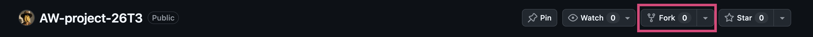

# Advanced Web Example Project
This project is an example website project for the Advanced Web class in 2026 Term 3.
## How to use this project
You will need to be signed in into your Github account. Then:
#### Fork this project
See image below

#### Install dependencies
In your terminal, make sure you are at the root directory of the project, run:
```
npm install
```
#### Run the project
After installing dependencies, you can start the project using the following command in the terminal
```
npm run dev
```
---
## Resources used in this project
- React framework [React Website](https://react.dev)
- Vite build framework [Vite Website](https://vite.dev)
- Bootstrap UI framework [Bootstrap Website](https://getbootstrap.com)
- React Bootstrap (to make Bootstrap work within a React framework) [React Bootstrap Website](https://react-bootstrap.netlify.app/)
- React Router for routing between views [React Router Website](https://reactrouter.com/)

Tutorials will refer to documentation section of each resource where necessary.

